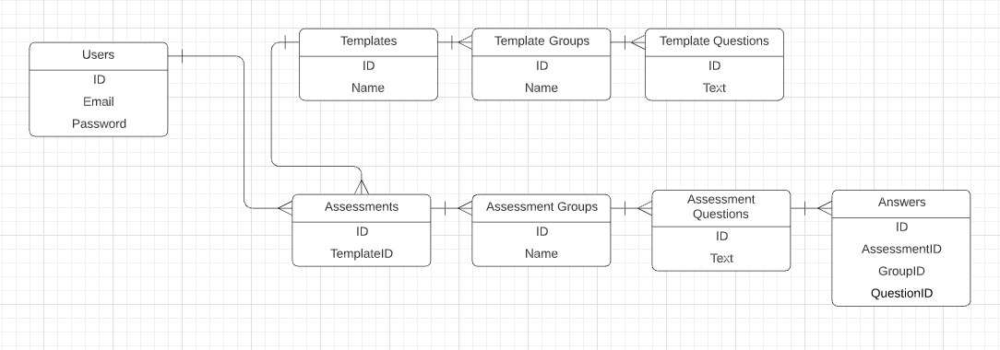

# Template for Koa.js

## Start database

### MongoDb and MySql containers
```bash
docker-compose up
```

## Install dependencies

Back-end
```bash
npm install --prefix ./server
```

Front-end
```bash
npm install --prefix ./app
```

## Run migrations
```bash
npm run mysql:migrations
```

## Start development
```bash
npm run dev --prefix ./server
npm run start --prefix ./app

```

Swagger endpoint http://localhost:8080/swagger

Database schema
