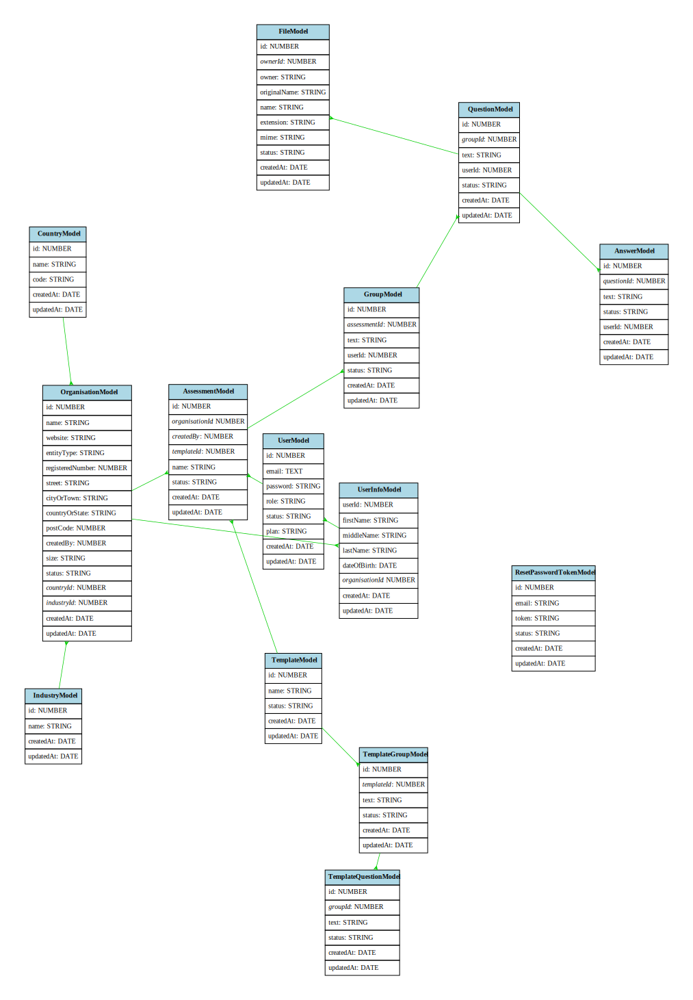

Node.js version required ^15

## Start database

### MongoDb and MySql containers
```bash
docker-compose up
```

## Install dependencies

Back-end
```bash
npm install --prefix ./server
```

Front-end
```bash
npm install --prefix ./app
```

## Run migrations
```bash
npm run migrations
```

## Start development

```bash
npm run dev --prefix ./server
npm run start --prefix ./app

```

## Generate super-admin

Set env vars

`KOA_SEEDER_PORT=8761`

`SUPER_ADMIN_EMAIL=admin@freedomrow.co.uk`

`SUPER_ADMIN_PASSWORD=Super-@dmin-123`

```bash
npm run factory:seeder
npm run factory:seeder:win

```

Swagger endpoint http://localhost:8080/swagger

Database schema
